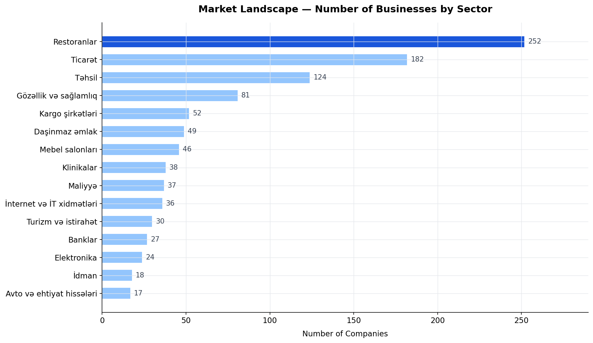
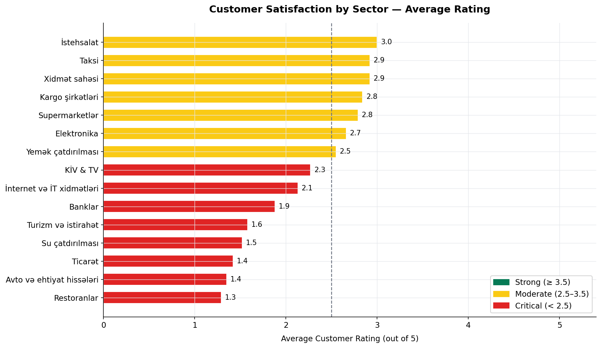
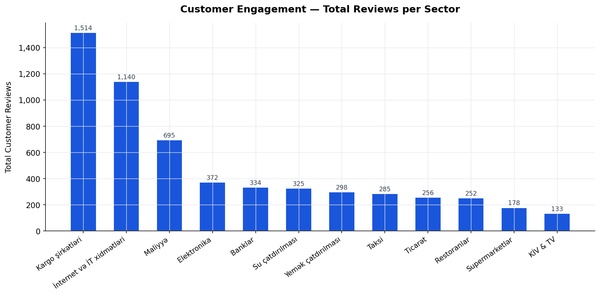
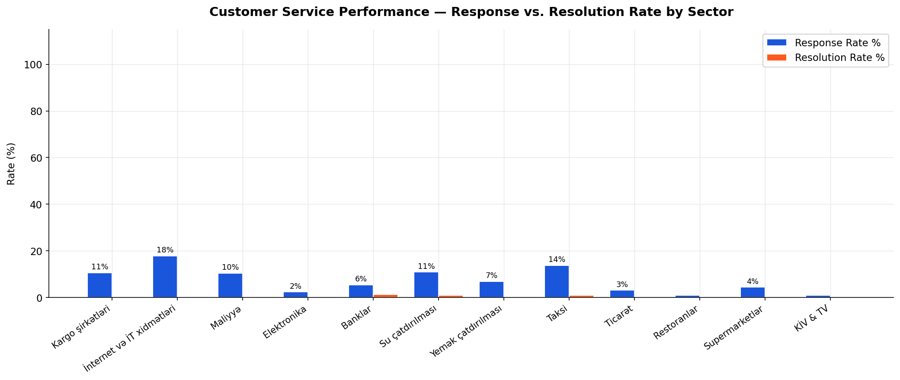
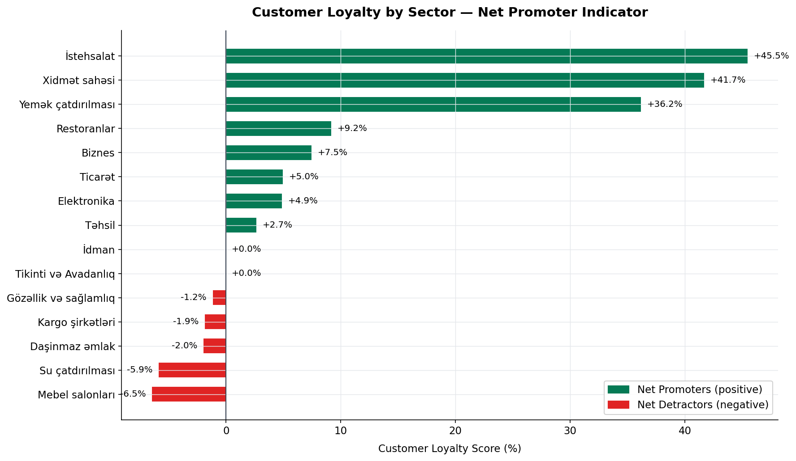
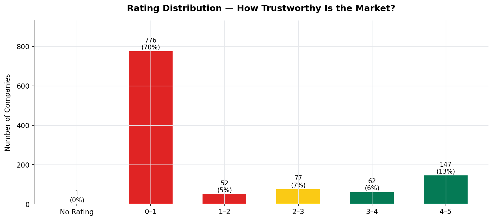
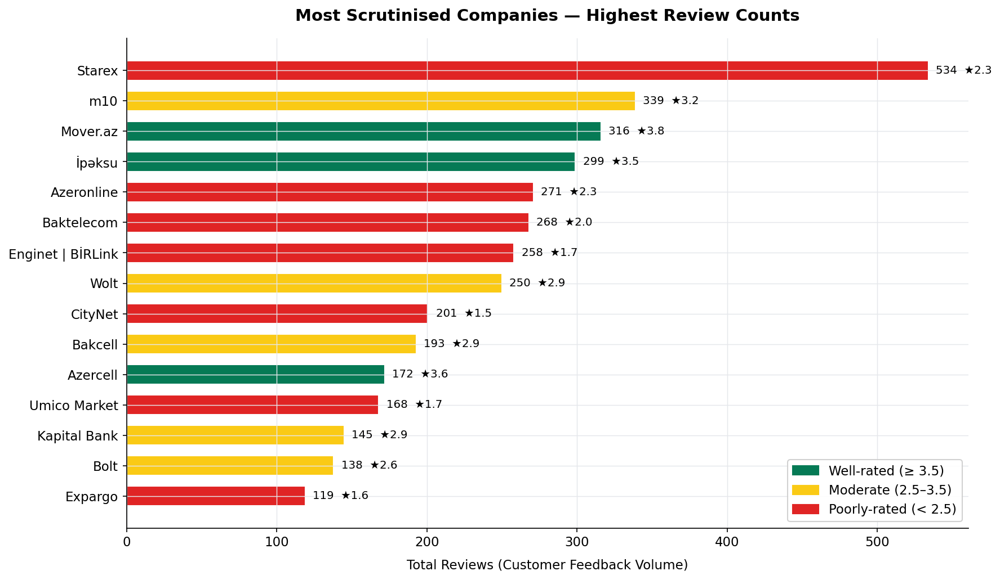
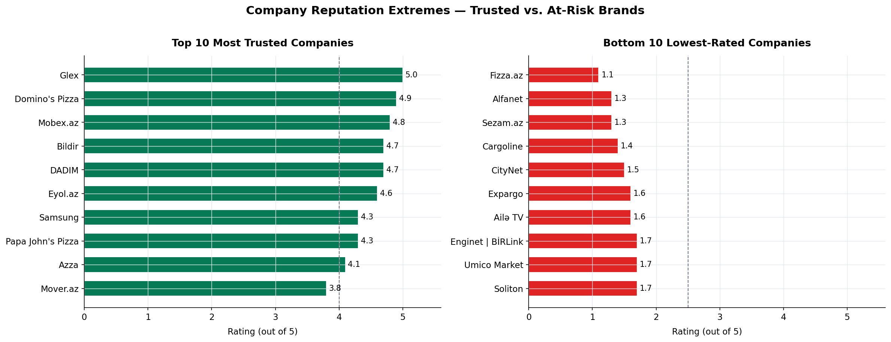
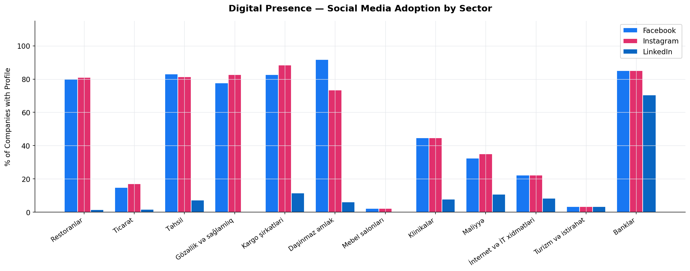
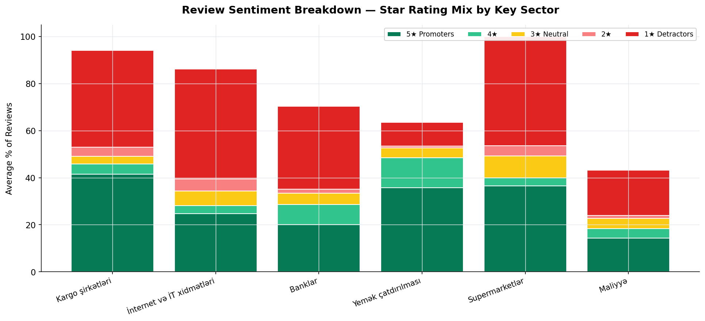

# bildir.az — Business Intelligence Report

- **Data source:** bildir.az (Azerbaijan's leading customer review platform)
- **Dataset:** 1,115 companies · 6,347 verified customer reviews · 24 business sectors
- **Collected:** February 2026

---

## Executive Summary

bildir.az is Azerbaijan's primary consumer feedback platform. An analysis of all 1,115 listed companies reveals a market where **customer trust is critically low, complaint resolution is nearly non-existent, and digital engagement is severely underdeveloped** across most sectors.

Among companies with reviews, the average customer rating is **3.09 out of 5** — just above the midpoint. However, the headline story is far more concerning: **60% of all listed businesses have zero reviews**, meaning the majority of the market operates with no public accountability whatsoever.

The handful of sectors that do serve customers well — food delivery, manufacturing, education — demonstrate that high satisfaction is achievable. The question is whether the rest of the market will respond.

---

## 1. Market Landscape — Who Is on the Platform?

**Restaurants dominate the platform** with 252 listed businesses — more than any other sector. Trade/Commerce (182) and Education (124) round out the top three. Together, these three sectors account for nearly half of all listed companies.

The presence of sectors like Cargo (52), Real Estate (49), and Furniture (46) underscores that bildir.az captures a broad cross-section of the Azerbaijani economy — from daily consumer services to major financial decisions.

**What this means for decision-makers:** The restaurant sector's size alone represents a major competitive battleground. Companies in sectors with fewer competitors on the platform (e.g., Manufacturing, Food Delivery) face less public comparison — but also a higher visibility premium when reviews do appear.

---

## 2. Customer Satisfaction by Sector

Only **3 out of 24 sectors** achieve an average rating above 3.5 (the "strong" threshold):

| Sector | Avg Rating | Signal |
|---|---|---|
| Manufacturing | 4.12 | Strong |
| Food Delivery | 4.00 | Strong |
| Education | 3.91 | Strong |
| Services | 3.89 | Strong |
| Restaurants | 3.57 | Strong |

At the other end, **three sectors are in critical territory** (below 2.5):

| Sector | Avg Rating | Signal |
|---|---|---|
| Auto & Parts | 2.30 | Critical |
| Furniture | 2.33 | Critical |
| Internet & IT Services | 2.47 | Critical |

**What this means:** The Internet/IT and Auto/Parts sectors are failing their customers at scale. Companies in these sectors carry significant reputational risk. A 2.3 average in a sector of 52 cargo companies is not a data anomaly — it is a systemic service failure.

---

## 3. Customer Engagement — Where Are Reviews Concentrated?

Restaurants, Cargo, and Internet/IT attract the most reviews — not because they are the best, but because **consumers feel strongly enough to act**. High review volumes in poorly-rated sectors signal unresolved frustration, not satisfaction.

The platform has accumulated **6,347 total reviews** across all companies. However, the distribution is deeply uneven: the 15 most-reviewed companies account for a disproportionate share of all feedback.

**What this means:** Sectors with high review volume and low ratings (Internet/IT, Cargo) are the most urgent targets for service improvement. Customer frustration has already reached the point of public expression.

---

## 4. Customer Service Performance — Response & Resolution

This is the most alarming finding in the dataset.

- **Average company response rate: 3.3%** — meaning 97 out of every 100 customer reviews go unanswered.
- **Average complaint resolution rate: 0.1%** — essentially zero.

Even in the best-performing sectors, these numbers rarely exceed single digits. Companies are present on the platform but largely ignoring what their customers are telling them.

**What this means:** There is a massive, market-wide failure in customer service follow-through. Any company that proactively responds to and resolves complaints will immediately stand out — not just as "better," but as practically alone in doing so. This is a low-cost competitive advantage being left on the table by nearly every business in the market.

---

## 5. Customer Loyalty — Net Promoter Indicator

Customer loyalty scores measure the balance between customers who would recommend a company and those who would actively warn others away.

**Overall average loyalty: +0.8%** — the market is barely in positive territory as a whole.

**Sectors that inspire loyalty:**

| Sector | Loyalty Score |
|---|---|
| Manufacturing | +45.5% |
| Services | +41.7% |
| Food Delivery | +36.2% |
| Restaurants | +9.2% |

**Sectors with net detractors (customers actively warning others):**

| Sector | Loyalty Score |
|---|---|
| Internet & IT Services | -28.8% |
| Tourism & Leisure | -17.8% |
| Auto & Parts | -16.5% |
| Media & TV | -16.0% |
| Banks | -12.5% |

**What this means:** Banks and Internet/IT companies carry a negative loyalty score — meaning they produce more detractors than promoters. In these sectors, customer relationships are actively working against the brand. The food delivery sector (+36.2%) proves that Azerbaijani consumers will reward companies that deliver on their promises.

---

## 6. Market-Wide Rating Distribution

Of the 1,115 companies on the platform:

- **675 companies (60%)** have a rating of zero — no reviews at all
- **171 companies (15%)** are well-rated (4–5 stars)
- **128 companies (11%)** are in the 1–2 star danger zone
- Only **71 companies (6%)** sit in the comfortable 3–4 range

**What this means:** The market is polarised. Companies either have no public profile (invisible to trust-conscious consumers) or are viewed poorly. The absence of a large "middle ground" of adequate companies suggests that mediocre service rarely escapes without negative feedback — consumers who bother to review tend to have strong opinions.

---

## 7. Most Scrutinised Companies

The highest review volumes belong to companies consumers interact with most frequently — and feel most strongly about:

| Company | Reviews | Rating | Verdict |
|---|---|---|---|
| Starex | 534 | 2.3★ | High scrutiny, low trust |
| m10 | 339 | 3.2★ | High scrutiny, moderate trust |
| Mover.az | 316 | 3.8★ | High scrutiny, strong trust |
| İpəksu | 299 | 3.5★ | High scrutiny, strong trust |
| Azeronline | 271 | 2.3★ | High scrutiny, low trust |
| Baktelecom | 268 | 2.0★ | High scrutiny, failing trust |
| Enginet / BİRLink | 258 | 1.7★ | High scrutiny, severely failing |
| Wolt | 250 | 2.9★ | High scrutiny, below average |
| CityNet | 201 | 1.5★ | High scrutiny, crisis level |
| Bakcell | 193 | 2.9★ | High scrutiny, below average |

Internet and telecom companies dominate the "most reviewed but poorly rated" list. These are household names receiving hundreds of complaints with almost no public response. **CityNet (1.5★) and Enginet/BİRLink (1.7★) are in a reputation crisis** that their review counts make impossible to ignore.

---

## 8. Company Reputation Extremes

The top 10 most trusted companies (minimum 10 reviews) demonstrate that exceptional ratings are achievable. These companies show that Azerbaijani consumers are willing to give 5-star reviews when service quality justifies it.

At the other extreme, the bottom 10 companies — all rated below 2.0 with meaningful review samples — represent brands where the relationship with customers has broken down. For these companies, the platform is functioning as a public record of failure.

**What this means:** The gap between best and worst in Azerbaijan's market is extreme. There is no shortage of consumer willingness to praise good service — which makes the widespread poor performance across most sectors a choice, not a market constraint.

---

## 9. Digital Presence — Social Media Adoption

Social media adoption across sectors:

- **Facebook:** 57% of all companies (637 out of 1,115)
- **Instagram:** 57% of all companies (638 out of 1,115)
- **LinkedIn:** Only 7% of all companies (76 out of 1,115)

Facebook and Instagram adoption is consistent across most sectors, suggesting these platforms have become a baseline expectation for Azerbaijani businesses. LinkedIn adoption is extremely low, reflecting either B2C focus or limited professional marketing maturity.

**What this means:** While social media presence is widespread, mere presence does not translate to service quality — companies with active Instagram profiles are as likely to have poor ratings as those without. Digital presence is not a substitute for customer service.

---

## 10. Review Sentiment Breakdown by Key Sector

This chart reveals the internal composition of ratings across six strategically important sectors. The story it tells is stark:

- **Food Delivery** has the highest share of 5-star reviews and the lowest share of 1-star reviews
- **Banks and Internet/IT** show the reverse — high 1-star proportions and low 5-star shares
- **Cargo companies** have a bimodal pattern: a meaningful share of both 5-star and 1-star reviews, suggesting inconsistent service quality rather than uniformly poor performance

**What this means:** For banks and Internet/IT providers, the challenge is not occasional bad experiences — it is a structurally broken customer relationship. The 1-star volume in these sectors reflects repeated, consistent failure rather than isolated incidents.

---

## Strategic Conclusions

### 1. The Accountability Gap is Enormous
60% of companies listed on bildir.az have zero reviews. Of those with reviews, 97% of feedback goes unanswered. The businesses succeeding in this market are doing so in spite of — not because of — any systematic customer service approach.

### 2. Response is the Highest-Leverage Action Available
With an average response rate of 3.3%, any company that commits to reading and responding to customer reviews will immediately differentiate itself. The bar is extraordinarily low.

### 3. Internet & Telecom Is in Crisis
The Internet/IT and Telecom sectors combine high consumer dependency, high review volume, very low ratings (2.47★ and 2.0★), and deeply negative loyalty scores. These sectors serve essential services that customers cannot easily stop using — which explains the high review volume — but the absence of meaningful responses suggests companies have calculated that retention does not require satisfaction.

### 4. Food Delivery and Manufacturing Prove the Model Works
Wolt, Mover.az, and manufacturing companies demonstrate that high-frequency, operationally complex service businesses can earn strong ratings and positive loyalty scores. The success conditions are not mysterious: deliver what you promise, handle problems when they arise.

### 5. Most of the Market Is Invisible
A business with zero reviews on bildir.az has no public proof of quality — and no public evidence of failure either. As platform usage grows, this invisibility will become a disadvantage. Companies that begin building a review presence now — even modest — will have a compounding advantage over those who do not.

---

## Dataset & Methodology

| Item | Detail |
|---|---|
| Source | bildir.az — Azerbaijan consumer review platform |
| Companies | 1,115 unique businesses |
| Sectors | 24 categories |
| Total reviews | 6,347 |
| Data collected | February 2026 |
| Fields per company | Name, category, founded, description, website, social media profiles, overall rating, total reviews, response rate, complaint resolution rate, customer loyalty score, star distribution (1–5) |

All data was collected via automated crawling of public pages. No private or authenticated data was accessed.

---

*Analysis and report generated from `data/data.csv`. Charts produced by `scripts/generate_charts.py`.*
